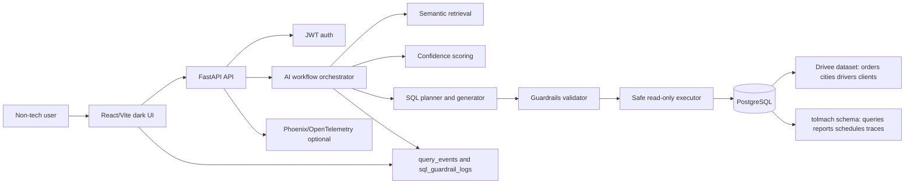
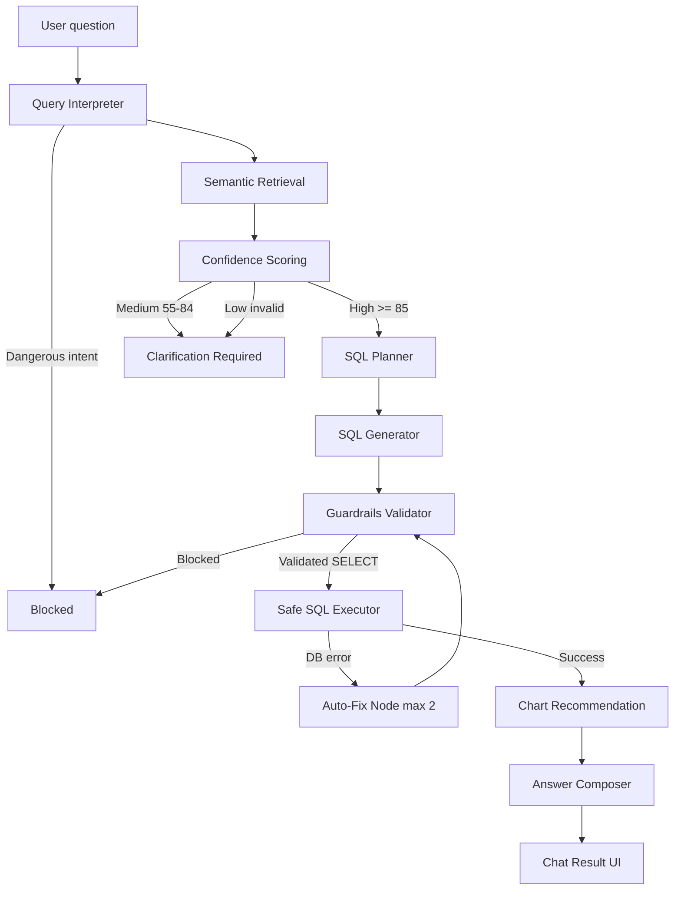
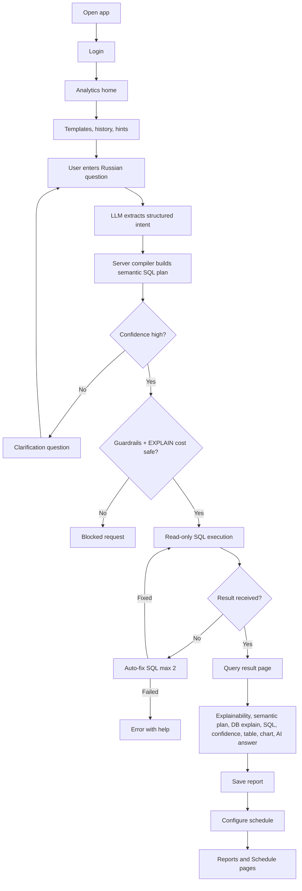
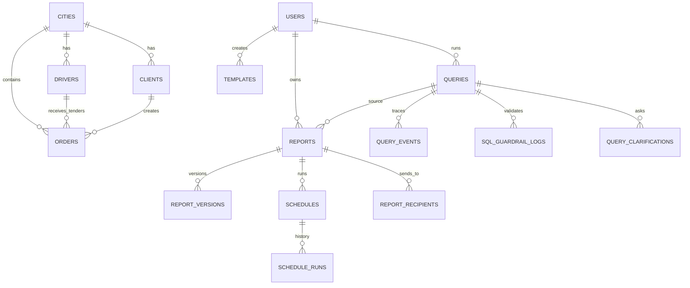
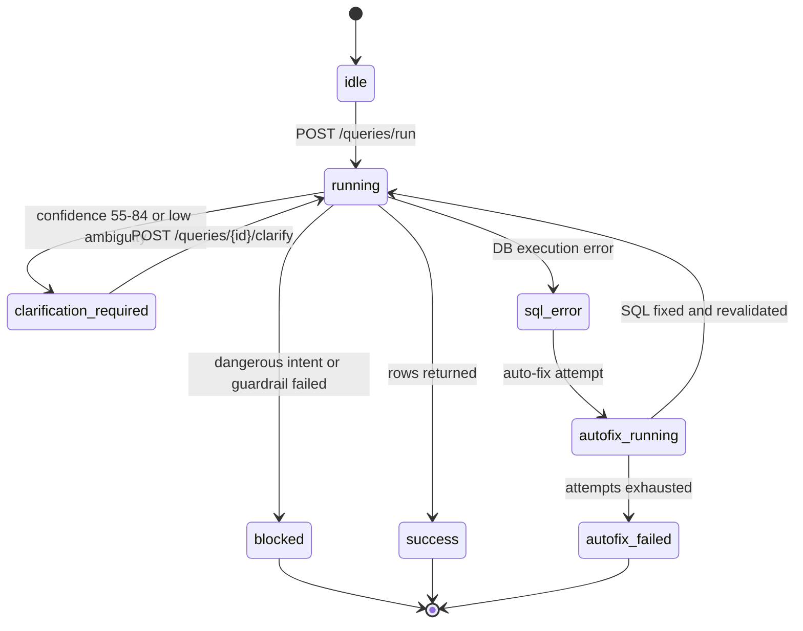

# Архитектура Толмач by Drivee

## High-Level System Architecture

## AI Workflow / Orchestration

## Userflow

## Database ER Diagram

## Query Lifecycle State Diagram

## Backend Modules

- `app/ai/interpreter.py` - NL interpretation: intent, metric, dimensions, filters, period, ambiguity flags.
- `app/ai/retrieval.py` - domain retrieval from semantic layer, templates, and few-shot examples.
- `app/ai/confidence.py` - explicit confidence model with high/medium/low bands.
- `app/ai/planner.py` - safe SQL plan from intent and retrieved semantics.
- `app/ai/generator.py` - SELECT-only SQL generation from plan.
- `app/ai/orchestrator.py` - workflow runner, trace events, clarification, auto-fix, answer composition.
- `services/guardrails.py` - parse-tree validation, denylist, table/column whitelist, policies, limit injection.
- `services/query_runner.py` - safe executor that accepts only `ValidatedSQL`.
- `services/bootstrap.py` - demo users, Drivee dataset, semantic terms, templates, policies, report/schedule seed.
- `alembic/` - PostgreSQL migrations, including `tolmach` schema and Drivee marts.

## Database Split

- Public schema: Drivee read-only dataset tables `orders`, `cities`, `drivers`, `clients`.
- Public views: `mart_orders`, `mart_tenders`, `mart_city_daily`, `mart_driver_daily`, `mart_client_daily`.
- `tolmach` schema: platform tables such as `users`, `queries`, `reports`, `schedules`, `templates`, `semantic_layer`, `query_events`, `sql_guardrail_logs`.

## MVP Decisions

- The UI remains on React/Vite to keep delivery focused inside the existing project.
- The AI contour now uses a real LLM as the primary structured-intent node; regex/rule logic remains only as a fallback path.
- LLM output is never executed as SQL directly; the server compiles SQL from semantic-layer keys and then validates it.
- Guardrails include EXPLAIN-based cost gating before execution.
- Auto-fix is intentionally capped at 2 attempts.
- Phoenix/OpenTelemetry runs in Docker Compose; persisted traces stay available for developers without cluttering the main chat UI.
