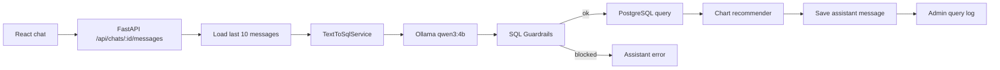
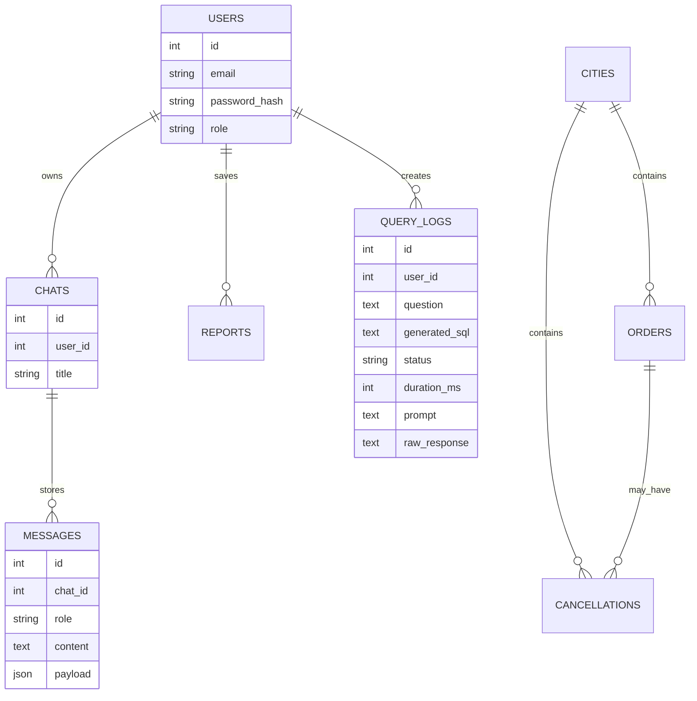

# Архитектура Толмача

## Поток запроса

## Backend

- `auth.py` - PBKDF2 password hashing and signed JWT.
- `models.py` - users, chats, messages, templates, reports, query logs, demo analytics tables.
- `services/prompts.py` - schema, semantic layer and JSON prompt for the model.
- `services/llm_providers.py` - Ollama provider for `qwen3:4b` plus deterministic fallback.
- `services/nl2sql.py` - thin service for provider selection and 5-minute cache.
- `services/guardrails.py` - SQL safety checks before execution.
- `services/query_runner.py` - PostgreSQL execution with statement timeout.
- `services/bootstrap.py` - demo users, templates, cities, orders, cancellations.

## Данные

